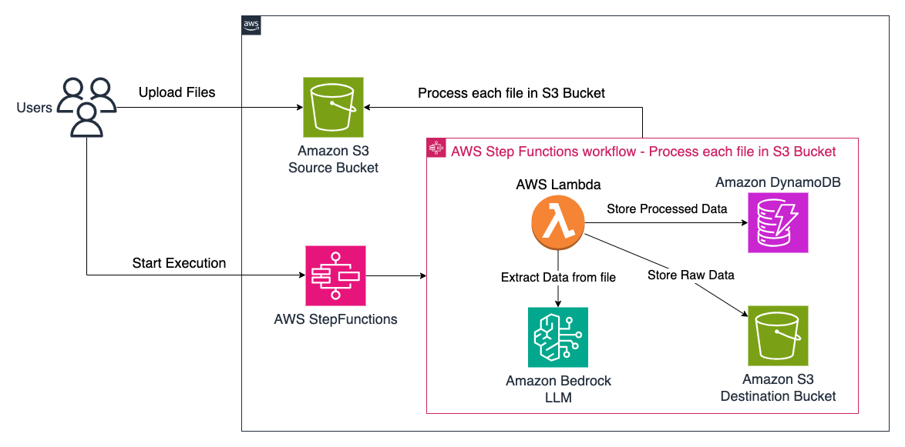
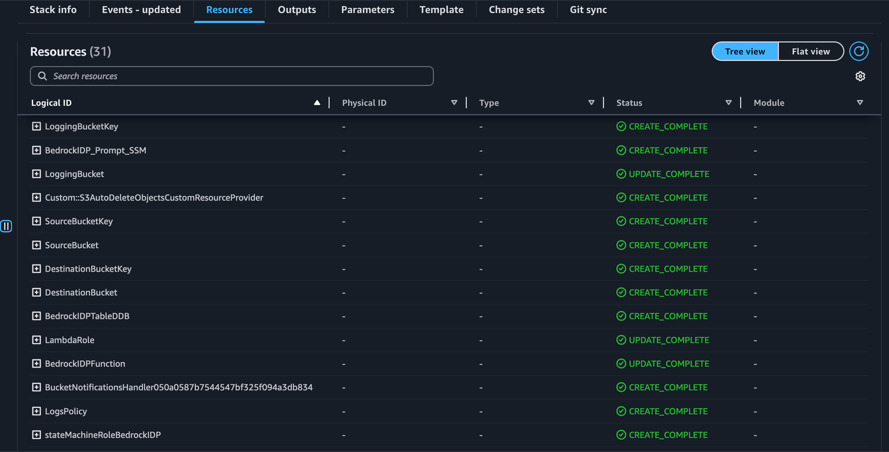
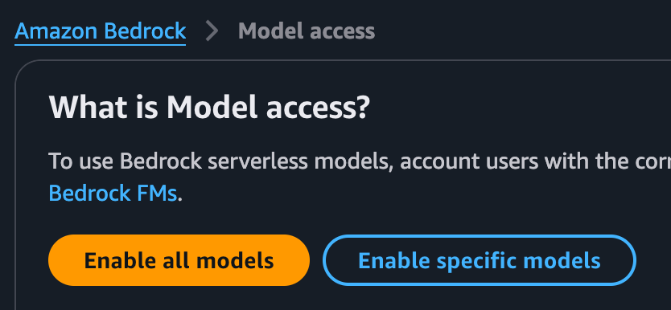
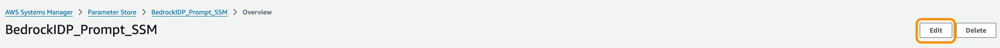
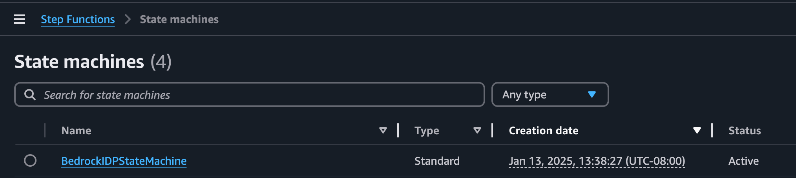
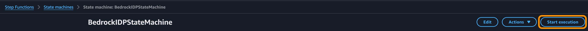
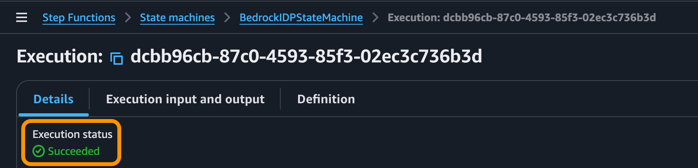

# Amazon Bedrock IDP using Java CDK

This project demonstrates how to use Amazon Bedrock to extract data from documents and images using your LLM of choice. The infrastructure is defined using AWS CDK with Java.

## Architecture



Below are the services that are required for deploying the solution.

* [Amazon Bedrock](https://docs.aws.amazon.com/bedrock/latest/userguide/what-is-bedrock.html)
* [AWS StepFunctions](https://docs.aws.amazon.com/step-functions/latest/dg/welcome.html)
* [Amazon DynamoDB](https://docs.aws.amazon.com/amazondynamodb/latest/developerguide/Introduction.html)
* [AWS Lambda](https://docs.aws.amazon.com/lambda/latest/dg/welcome.html)
* [Amazon S3](https://docs.aws.amazon.com/AmazonS3/latest/userguide/Welcome.html)

## Deploy using AWS CDK

### Pre-requisites

Before getting started, make sure you have the following:

- AWS Account
- Docker installed on your local machine
    - Docker version 27 or later. If missing install Docker from [here](https://docs.docker.com/engine/install/).
      ```shell
      docker --version
      ```
- Java Development Kit (JDK) installed on your local machine
    - Java 21 or later. If missing install Amazon Corretto Java 21 from [here](https://docs.aws.amazon.com/corretto/latest/corretto-21-ug/what-is-corretto-21.html).
      ```shell
      java --version
      ```

    - Maven 3.9 or later. If missing install Maven from [here](https://maven.apache.org/download.cgi).
    - Note: Java version showed in the below output should be 21 or later.
      ```shell
      mvn --version
      ```

- AWS CLI configured with valid credentials
    - AWS CLI. If missing install latest AWS CLI from [here](https://docs.aws.amazon.com/cli/latest/userguide/install-cliv2.html).
      ```shell
      aws --version
      ```
- Node.js and npm installed (required for CDK)
    - Node.js 22.x or later. If missing install Node.js from [here](https://nodejs.org/en/download/).
      ```shell
      node --version
      ```

- AWS CDK - Install the latest [AWS CDK Toolkit](https://docs.aws.amazon.com/cdk/v2/guide/cli.html) globally using the following command:
    ```shell
    npm install -g aws-cdk
    ```
    ```shell
    cdk --version
    ```
    - CDK Bootstrap - Bootstrap your AWS account for CDK. This only needs to be done once per account/region.
      ```shell
      cdk bootstrap aws://<account>/<region>
      ```

## Installation

Clone this repository and navigate to the project directory.
```shell
git clone https://<Repo-Url>.git
cd amazon-bedrock-idp-java-cdk
```

## Build
Run below build command from the root directory of the project.
```shell
mvn clean install
```

## Deployment

Change to the Infra directory of the project.
```shell
cd Infra
```

### CDK deployment:
Run the below command to deploy the application.
Note: CDK would need to your approval before deploying.
```shell
cdk deploy
```
To skip the approval step, please use the below command.
```shell
cdk deploy --require-approval never
```

## Verify
Make sure you are in the right AWS account and region.

[AWS CloudFormation](https://us-west-2.console.aws.amazon.com/cloudformation/home) will create similar to below resources
<br> Note: Not all the resources are shown in the screenshot below.


## Bedrock IDP Process

### Step 1: Enable the Bedrock Model Access

Navigate to Amazon Bedrock -> Model Access and enable the model as shown below;


1. Make sure you are in the right AWS region. Example: us-west-2
2. Enable specific models or all models.
   1. Default model used in this sample is "[Anthropic Claude 3.5 Sonnet v2](https://us-west-2.console.aws.amazon.com/bedrock/home?region=us-west-2#/model-catalog/serverless/anthropic.claude-3-5-sonnet-20241022-v2:0)"
   2. Make sure you are enabling this model.
3. If you would like to use a different model, please enable the model here in the 'Model Access'.
   1. Update the **"Model_ID"** environment variable in the AWS Lambda (BedrockIDPFunction) created by CDK. 

### Step 2: Upload your documents to S3 Bucket
1. Navigate to your source Amazon S3 bucket created by CDK.
2. Upload the documents for which you need to extract the information. 

Important Note:
1. Make sure you are uploading same document types so that extracted data aligns with your expectation.
<br> Example: All the documents are images of driver license. 
2. Both Amazon S3 and Amazon DynamoDB where Data is stored are encrypted by this solution.

### Step 3: Update your extraction prompt in Parameter Store created by CDK
Navigate to AWS Systems Manager -> Parameter Store as shown below;



1. Click 'Edit' and add/update your extraction Prompt to the LLM.
2. This prompt will be used for data extraction from your documents.

Note: Make sure your prompt is calling out to produce a valid JSON document without any filler words in the response. 

### Step 4: Confirm the DynamoDB Tables created by CDK
Below is the detail of the BedrockIDP-Table created by CDK.

* This will be used to store the extracted information from the source S3 bucket.
*
* | Attribute Name | Attribute Type | Key Type |
*
* | fileName | String | Primary Key |

Note: other Column Keys are created from the extracted data 

### Step 5: Execute the AWS Step Function for BedrockIDP Process
This step function will extract  each from the S3 bucket to the DynamoDB table created by CDK.

Navigate to the Step Functions Console and click on the Step Function created by CDK.


Click on the Step Function name and click on View details -> Start Execution.


Once the execution is completed successfully as shown below;


After successful execution, data from all the files in the source S3 bucket are extracted and populated in the following;
 1. DynamoDB table created by CDK.
 2. Populated as JSON file on destination S3 bucket created by CDK.

Navigate to Amazon DynamoDB Console and click on the table name which ends with '-Contacts' and click on Items to verify the import.

## Cleanup

Run the below command to delete the application.
```shell
cdk destroy
```
This will delete all the provisioned resources from your AWS account.
