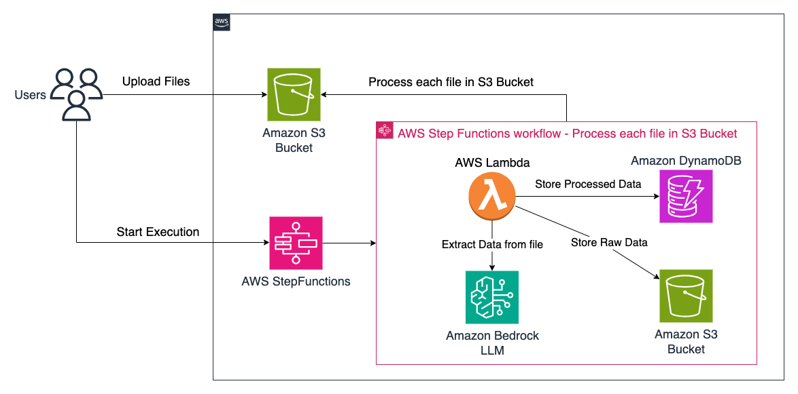
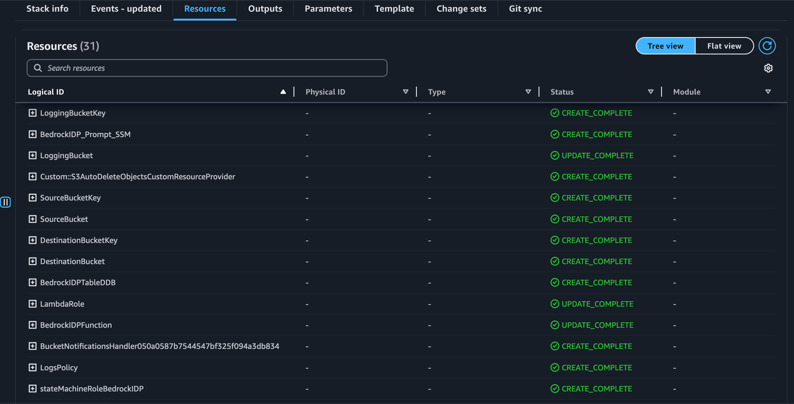

# Amazon Bedrock IDP using Java CDK

This project demonstrates how to use Amazon Bedrock to extract data from documents and images using your LLM of choice. The infrastructure is defined using AWS CDK with Java.

## Architecture



## Pre-requisites

Before getting started, make sure you have the following:

- AWS Account
- Docker installed on your local machine
    - Docker version 27 or later. If missing install Docker from [here](https://docs.docker.com/engine/install/).
      ```shell
      docker --version
      ```
- Java Development Kit (JDK) installed on your local machine
    - Java 21 or later. If missing install Amazon Corretto Java 21 from [here](https://docs.aws.amazon.com/corretto/latest/corretto-21-ug/what-is-corretto-21.html).
      ```shell
      java -version
      ```

    - Maven 3.9 or later. If missing install Maven from [here](https://maven.apache.org/download.cgi).
    - Note: Java version showed in the below output should be 21 or later.
      ```shell
      mvn -version
      ```

- AWS CLI configured with valid credentials
    - AWS CLI. If missing install latest AWS CLI from [here](https://docs.aws.amazon.com/cli/latest/userguide/install-cliv2.html).
      ```shell
      aws --version
      ```
- Node.js and npm installed (required for CDK)
    - Node.js 22.x or later. If missing install Node.js from [here](https://nodejs.org/en/download/).
      ```shell
      node -v
      ```

- AWS CDK - Install the latest [AWS CDK Toolkit](https://docs.aws.amazon.com/cdk/v2/guide/cli.html) globally using the following command:
    ```shell
    npm install -g aws-cdk
    ```
    ```shell
    cdk --version
    ```
    - CDK Bootstrap - Bootstrap your AWS account for CDK. This only needs to be done once per account/region.
      ```shell
      cdk bootstrap aws://<account>/<region>
      ```

## Installation

Clone this repository and navigate to the project directory.
```shell
git clone https://<Repo-Url>.git
cd amazon-bedrock-idp-java-cdk
```

## Build
Run below build command from the root directory of the project.
```shell
mvn clean install
```

## Deployment

Change to the Infra directory of the project.
```shell
cd Infra
```

### CDK deployment:
Run the below command to deploy the application.
Note: CDK would need to your approval before deploying.
```shell
cdk deploy
```
To skip the approval step, please use the below command.
```shell
cdk deploy --require-approval never
```

## Verify
Make sure you are in the right AWS account and region.

[AWS CloudFormation](https://us-west-2.console.aws.amazon.com/cloudformation/home) will create similar to below resources
<br> Note: Not all the resources are shown in the screenshot below.


[//]: # (## Testing)

[//]: # ()
[//]: # (1. Validate you are able to access the application by Clicking the "CloudFrontDomain" Url from AWS CloudFormation Outputs tab.)

[//]: # (2. Add Users to Amazon Cognito and use the credentials to log in to the Streamlit App.)

[//]: # ()
[//]: # (![AWSCloudformation_Outputs.png]&#40;AWSCloudformation_Outputs.png&#41;)

## Cleanup

Run the below command to delete the application.
```shell
cdk destroy
```
This will delete all the provisioned resources from your AWS account.
